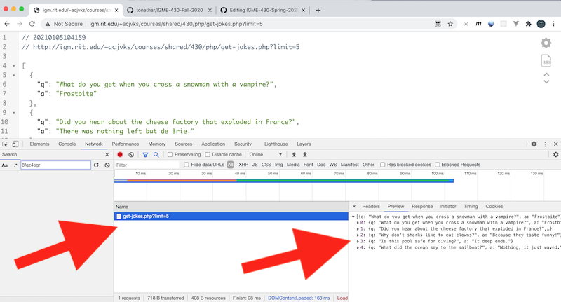
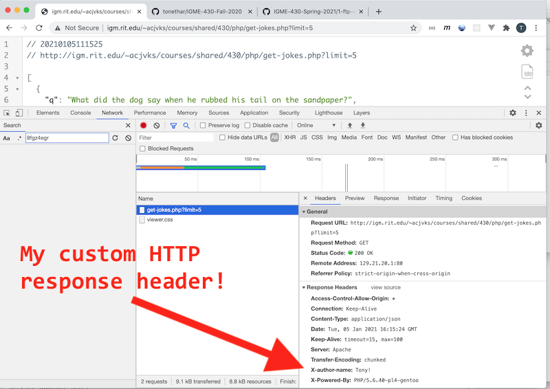
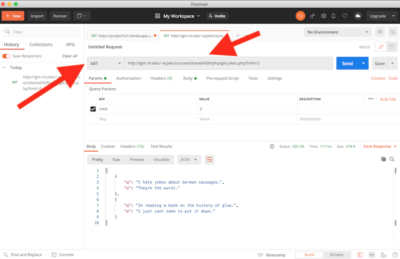

# Skill #1 - Client Tools and the HTTP Protocol

## I. Overview
- Let's take one last look at `banjo.rit.edu` ...
- PHP? Don't worry, we will only be using it on this assignment, and on the next one when we post **random-jokes.php** to the [Heroku](https://www.heroku.com/) cloud service
- Goals:
  - post a PHP file to banjo using an FTP client (ex. [FileZilla](https://filezilla-project.org/))
  - install these developer tools - which will greatly aid you when you need to debug your code:
    - [JSON Viewer](https://chrome.google.com/webstore/detail/json-viewer/gbmdgpbipfallnflgajpaliibnhdgobh?hl=en-US)
    - [Postman](https://www.postman.com/downloads/)
  - use JSON viewer to see parts of the HTTP protocol in action

 
<hr>

## II. PHP stuff we already did in IGME-330

### II-A. Upload *random-jokes.php* to `banjo.rit.edu`
- Using the FTP client of your choise (ex. [Filezilla](https://filezilla-project.org/)) post the **random-jokes.php** file below to `banjo.rit.edu` at `yourid/430/random-jokes.php`
- If you have forgotten how to post files to banjo check out this page: https://github.com/tonethar/IGME-235-Shared/blob/master/notes/core-skills/ftp-upload-walkthrough.md

**random-jokes.php**

```php
<?php
	/*
		Name: get-jokes.php
		Description: Returns an array of random jokes in JSON format
		Author: 
		Last Modified: 
		Example usage: get-jokes.php?limit=3
	*/
	
	// I. define some constants
	define('MIN_LIMIT', 1); 
	define('MAX_LIMIT', 10); 
	
	
	// II. $jokes contains our data
	// this is an indexed array of associative arrays
	// the associative arrays are jokes -  they have an 'q' key and an 'a' key
	$jokes = [
		["q"=>"What do you call a very small valentine?","a"=>"A valen-tiny!"],
		["q"=>"What did the dog say when he rubbed his tail on the sandpaper?","a"=>"Ruff, Ruff!"],
		["q"=>"Why don't sharks like to eat clowns?","a"=>"Because they taste funny!"],
		["q"=>"What did the boy cat say to the girl cat?","a"=>"You're Purr-fect!"],
		["q"=>"What is a frog's favorite outdoor sport?","a"=>"Fly Fishing!"],
		["q"=>"I hate jokes about German sausages.","a"=>"Theyre the wurst."],
		["q"=>"Did you hear about the cheese factory that exploded in France?","a"=>"There was nothing left but de Brie."],
		["q"=>"Our wedding was so beautiful ","a"=>"Even the cake was in tiers."],
		["q"=>"Is this pool safe for diving?","a"=>"It deep ends."],
		["q"=>"Dad, can you put my shoes on?","a"=>"I dont think theyll fit me."],
		["q"=>"Can February March?","a"=>"No, but April May"],
		["q"=>"What lies at the bottom of the ocean and twitches?","a"=>"A nervous wreck."],
		["q"=>"Im reading a book on the history of glue.","a"=>"I just cant seem to put it down."],
		["q"=>"Dad, can you put the cat out?","a"=>"I didnt know it was on fire."],
		["q"=>"What did the ocean say to the sailboat?","a"=>"Nothing, it just waved."],
		["q"=>"What do you get when you cross a snowman with a vampire?","a"=>"Frostbite"]
	];
	
	
	// III. Sanitize the `limit` parameter to be sure that it is numeric, and is not too small or large
	$limit = MIN_LIMIT; // the default
	if(array_key_exists('limit', $_GET)){ // if there is a `limit` parameter in the query string
		$limit = $_GET['limit'];
		$limit = (int)$limit; // explicitly cast value to an integer
		$limit =  ($limit < 1) ? MIN_LIMIT : $limit; // PHP has a ternary operator too
		$limit =  ($limit > MAX_LIMIT) ? MAX_LIMIT : $limit; // PHP has a ternary operator too
	}
	
	
	// IV. Do a final check that there are enough jokes in the $jokes array
	if($limit > count($jokes)){
		$limit = count($jokes);
	}
	
	
	// V. get a random element of the $jokes array
	// there are a bunch more PHP array functions at: http://php.net/manual/en/ref.array.php
	// https://www.php.net/manual/en/function.shuffle.php
	// https://www.php.net/manual/en/function.array-push.php
	$randomKeys = array_keys($jokes); // creates an array of indexes - something like [0,1,2,3,4,5,6,7,...]
	shuffle($randomKeys); // randomizes the $randomKeys array - something like [1,5,3,2,0,8,4,7,6, ...]
	$randomKeys = array_slice($randomKeys, 0, $limit); // just get the first `n` number of indexes we need
	$randomJokes = []; // the random jokes will go here
	foreach($randomKeys as $key){ // loop through $randomKeys
 		array_push($randomJokes,$jokes[$key]); // add a random joke to the array
 	}
	
	
	// VI. Send HTTP headers
	// https://www.php.net/manual/en/function.header.php
	// DO THIS **BEFORE** you `echo()` the content!
	header('content-type:application/json');      			// tell the requestor that this is JSON
	header('Access-Control-Allow-Origin: *');     			// turn on CORS
	header('X-this-430-service-is-kinda-lame: true');   // a custom header 
	
	
	// VII. Send the content
	// json_encode() turns a PHP associative array into a string of well-formed JSON
	// https://www.php.net/manual/en/function.json-encode.php
	$string = json_encode($randomJokes);
	echo $string;

?>
```

- a working example version is here: http://igm.rit.edu/~acjvks/courses/shared/430/php/get-jokes.php?limit=5

<hr>

### II-B. Review

- Now open up the version that you posted in the Chrome web browser to be sure that it works, it should appear like the screenshot below
- If your screen is not as nicely formatted as mine, go download the [JSON Viewer](https://chrome.google.com/webstore/detail/json-viewer/gbmdgpbipfallnflgajpaliibnhdgobh?hl=en-US) Chrome extension now
- Open up the web inspector as I have done below:
  - then select the **Network** tab
  - reload the browser so that the **get-jokes.php** file is visible in the inspector
  - click on the **get-jokes.php**
  - click on the **Preview** tab on the right to see the content that the web service sent back
  

  
<hr>

#### II-B-i. The HTTP Protocol

- In client-server protocols, like HTTP, sessions consist of three phases:
  - The client establishes a TCP connection
  - The client sends its request, and waits for the answer
  - The server processes the request, sending back its answer, providing a status code and appropriate data

***In the screenshot below note that we can see quite a bit of this [HTTP protocol ("Hypertext Transfer Protocol")](https://en.wikipedia.org/wiki/Hypertext_Transfer_Protocol) in action. The browser first establishes a connection with the web server. Then it makes an HTTP request:***

1) The [HTTP Request Method](https://en.wikipedia.org/wiki/Hypertext_Transfer_Protocol#Request_methods):

- Here the browser is using the http `GET` *method* (or "verb") of HTTP - which very simply means "give me this file"
  - other common HTTP methods include `POST` ("here's some data - a string of text for example - that you need to save") and 
  - `DELETE`("delete the specified resource") and 
  - `HEAD` ("just send me the headers - i.e. the metadata about the file - not the file itself")
  - very soon, we will be creating our own customized HTTP web server (using JavaScript and the Node.js runtime) and learn how to write code that responds to these requests:
    - returning a specified resource (`GET`)
    - saving a resource that was sent to the server by the browser (`POST`)
    - deleting a specified resource (`DELETE`)
    - sending back headers (metadata) about a resource (`HEAD`)
    

2) Then we get an HTTP **response message** back it consists of ([thanks wikipedia](https://en.wikipedia.org/wiki/Hypertext_Transfer_Protocol#Response_message)):

<hr>


<hr>

**Here's more detail about each of these steps:**

2A) The *status line* includes an [HTTP Status Code](https://en.wikipedia.org/wiki/Hypertext_Transfer_Protocol#Status_codes)

- Here the server is sending back a *status code* (`200`) and a *reason phrase* (`OK`) to indicate that the request was successful
  - other common status codes include `404` ("Not Found") and `500` ("Internal Server Error")
  - a full list HTTP status codes is here: https://en.wikipedia.org/wiki/List_of_HTTP_status_codes
  - In this class we will program our Node.js servers to send back these and other status codes (such as `201`, `204`, `206`, `400`, `401` and `403`) depending on the nature of a user request
  
2B) Multiple [HTTP Response Headers](https://en.wikipedia.org/wiki/List_of_HTTP_header_fields)

- These response headers are *metadata* about the response. You can see that the web server is sending back information about the **Connection**, **Server**, and **Date**. It is also sending back 3 headers that we specified in our PHP:
  - `Access-Control-Allow-Origin: *` (to enable [CORS](https://developer.mozilla.org/en-US/docs/Web/HTTP/CORS), which we talked about in 330)
  - `Content-Type: application/json` (to tell the browser how to decode the bytes that are getting sent over)
  - `X-this-430-service-is-kinda-lame: true` (a custom header - this does nothing - it just shows that it is possible to send non-standard headers - although it would certainly be possible to write some client-side JS to look for this header)
    
2C) an empty line, which tells the requester (the browser) - "Hey, I'm done with the headers!" 

2D) Optionally, the actual content (which above, was a JSON file of jokes)
    

<hr>
  


<hr>

### II-C. Do this!

- Modify the PHP code so that it is now sending an HTTP header named `X-author-name` with a value of `your-first-name` (your actual first name or nickname)
- Take a screenshot showing this as I have done so below - you are also required to utilize Chrome's JSON Viewer - so go ahead and install it if you have not yet done so - [JSON Viewer](https://chrome.google.com/webstore/detail/json-viewer/gbmdgpbipfallnflgajpaliibnhdgobh?hl=en-US)



<hr>

## III. Postman

- Postman is a really handy tool for testing and debugging server-side code - you can use it send `POST` and `HEAD`requests, specific request headers, and to specify the "message body" i.e. content that you want to send. It will be invaluable once we start writing server-side code
- Download it here: https://www.postman.com/downloads/
- Open it up and point it at your copy of **random-jokes.php** as I have done in the screenshot below
  - Note that you will need to specify the HTTP *method* - `GET` - in the pulldown
  - You will also need to type in the URL, and then click the Send button

<hr>



<hr>

### III-A. Do this!
 - To document that you have Postman installed, take a screenshot of your copy of **random-jokes.php** as seen in Postman, just as I have done above

<hr>

## IV. Review Questions

1) What does HTTP stand for?

2) What is, in terms of electronic communication, a *protocol*? (Google it if you don't know)

3) List the 3 phases of the HTTP protocol

4) Which HTTP *request method* is used by the browser when the user types a URL into the location bar?

5) List the 4 HTTP *request methods* we talked about above

6) List the 4 things we get back in an HTTP *response message*

7) The first of these is the *status line* of an HTTP response message - which includes a *status code* and a *reason phrase* - give 3 examples of each

8) The second of these are the *response header fields* of an HTTP response message - give 3 examples of these

 
<hr>

## V. Submission & Rubric (out of 10 points)
- In the myCourses dropbox, upload the two screenshots you took in part II-C. & part III-A. above
- Type the following into the comments field of the dropbox:
  - the link to your working version of **random-jokes.php** that is running on banjo
  - the answers to the review questionsin part IV. above
- Rubric:
  - missing Screenshots (-5 each) 
  - no link, or link not working (-5)
  - Chrome JSON Viewer extension not utilized (-5) 
  - Postman App not utilized (-5) 
  - incorrect answers to questions (-1/2 each)


<hr><hr>

