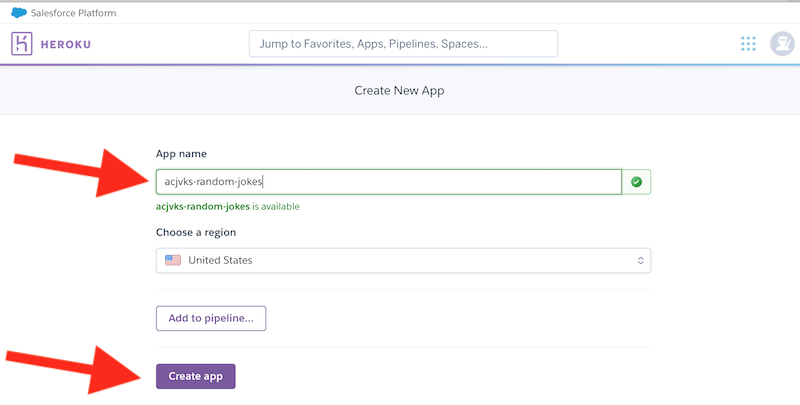
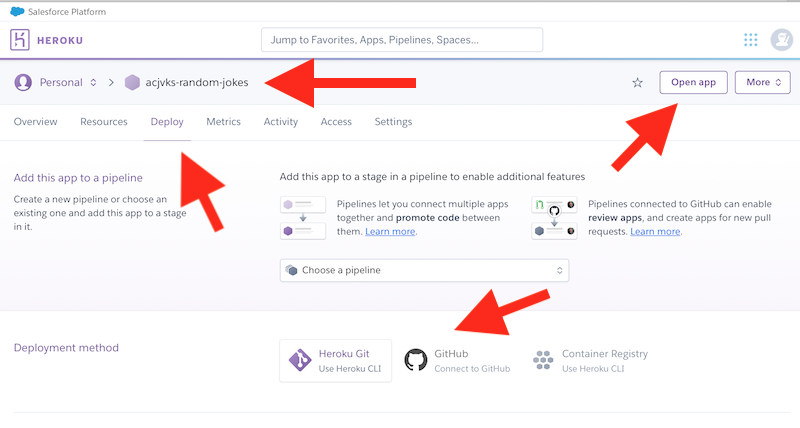
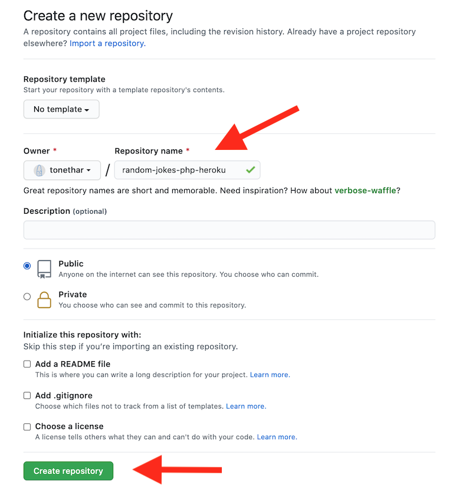
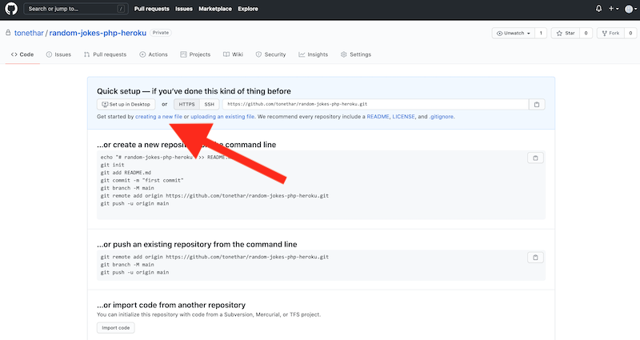
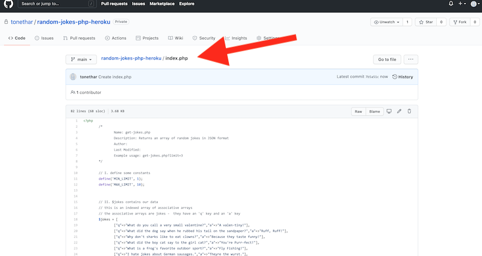
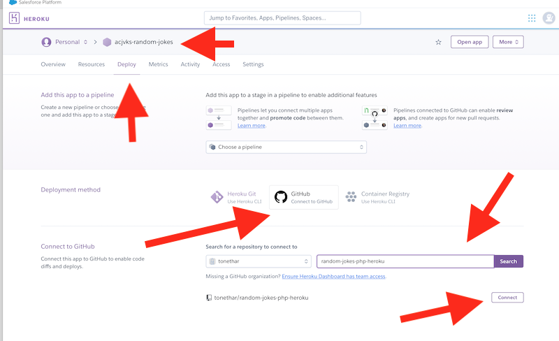

# Skill #2  - GitHub and Heroku

## I. Overview

- We are going to post the **random-jokes.php** code from last time and deploy it to Heroko
- What is Heroku? It is a cloud ["platform as service" (PaaS)](https://en.wikipedia.org/wiki/Platform_as_a_service) environment where developers can host applications written in Java, JavaScript, PHP and other languages
- Heroku is where we will hosting our apps for the rest of the semester

## II. Create a Heroku account

- Head here to create a Heroku account --> https://signup.heroku.com/
  - it's free!
  - if you give them a credit card number to verify your identity, you can get a few more free benefits, including the ability to host more apps. It's very easy to set up your account so that you will enver get charged anything

## III. Create a Heroku App

- A) Head to the Heroku Dashboard and click on the "New" and then "Create New App" buttons
  

 

- B) Heroku apps need to have a globally unique name - name the app `abc1234-random-jokes` (where `abc1234` is your ID, which should be unique):
  - Then click the "Create app" button

- C) You should now be on the "Deploy" tab of this app:
  - Note that the bottom arrow points at a "Connect to GitHub" button - GitHub is where we will need to post the PHP file that we want to upload to here - we'll handle that in a second

- D) For now, just verify that the app works by clicking the "Open App" button, which will give you the following default Heroku page in a new browser window

 
## IV. Set up a GitHub repository

- A) Head to github at https://github.com/ and login
  - Create a new repository named `random-jokes-php-heroku`

- B) Click the "Creating a new file" link

- C) Name the file **index.php**:
  - copy and paste the **random-jokes.php** code into the file
  - save the file by clicking the "Commit new file" button

## V. Linking your Heroku App to the GitHub repository

- A) Easy! 
  - Just head back to Heroku control panel, choose your app, and head to the Deploy tab
  - Then click the "GitHub - Connect to GitHub" button in the "Deployment method" section of the page
  - Then search for your respository
  - Then click the "Connect" button

| <-- Previous Unit | Home | Next Unit -->
| --- | --- | --- 
|   [Skill #1 - Client Tools and the HTTP Protocol](1-client-tools-and-http-protocol.md) |  [**IGME-430**](../) | [**Skill #3 - **]()
