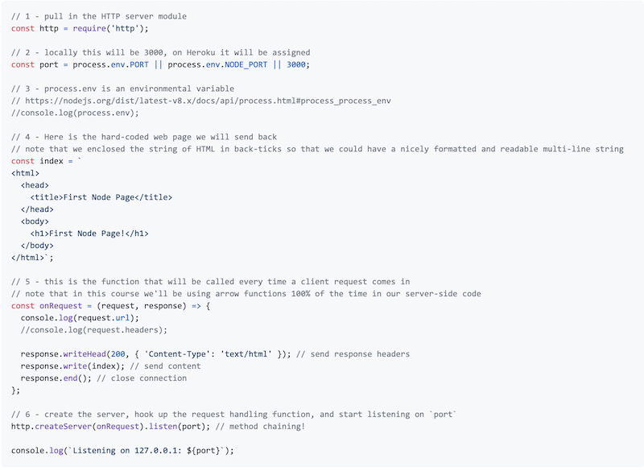
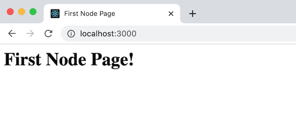
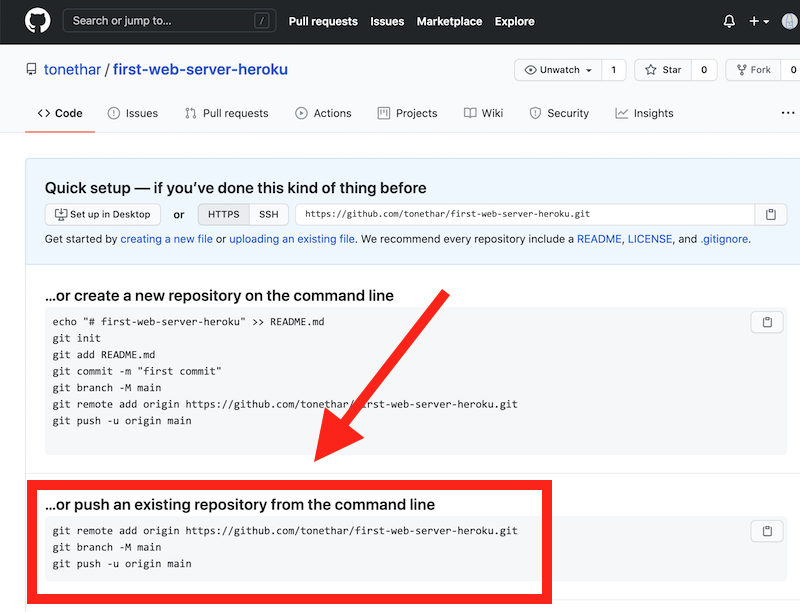
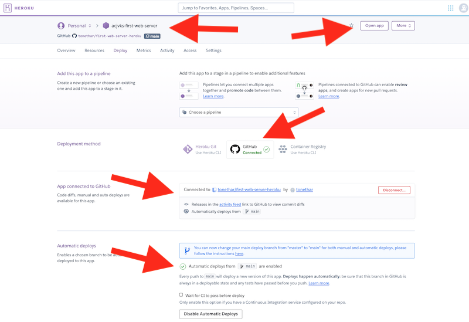

# Skill #5 - First Node Web Server

- Let's make a web server!
- What does a web server do? - *"The primary function of a web server is to store, process and deliver web pages to clients"* -  [Wikipedia - Web server](https://en.wikipedia.org/wiki/Web_server)

## 0. Video & HW
- The videos for this lecture, which walk through the notes, are here:
  - [Essential Skills - Part V (09:50)](https://video.rit.edu/Watch/430-essential-skills-5)
  - [Essential Skills - Part V-B (07:04)](https://video.rit.edu/Watch/430-essential-skills-5B)
- See the HW assignment at the bottom of the page (Part V.)

## I. Overview

- Last time we "imported" - using `require()` - an *external* library (aka "package") named `nanoid`
- this time we will use a *built-in* library called `http` to help us build a simple web server
- the properties and methods that we will use today are: 
  - [`http.createServer(listener)`](https://nodejs.org/api/http.html#http_http_createserver_options_requestlistener) - will create a new http web server for us, and any client requests that come in will be routed to `listener`
  - [`httpServer.listen(port)`](https://nodejs.org/api/http.html#http_server_listen) - the server will begin to listen on the `port` we provide
  - [`ClientRequest.url` and `ClientRequest.headers`](https://nodejs.org/api/http.html#http_class_http_incomingmessage) - incoming requests will have a `clientRequest` and a `httpResponse` object - the `.url` and `.headers` properties give us information about that client request
  - [`httpResponse.writeHead()`](https://nodejs.org/api/http.html#http_response_writehead_statuscode_statusmessage_headers) - where we specify the *http response headers* we want to send back
  - [`httpResponse.write()`](https://nodejs.org/api/http.html#http_response_write_chunk_encoding_callback) - where we specify the *content* we want to send back
  - [`httpResponse.end()`](https://nodejs.org/api/http.html#http_response_end_data_encoding_callback) - close the connection
- some other concepts that may come up:
  - [Wikipedia - Port (computer networking)](https://en.wikipedia.org/wiki/Port_(computer_networking))
  - [JS Template Literals (Template Strings) - created with backticks (\``)](https://developer.mozilla.org/en-US/docs/Web/JavaScript/Reference/Template_literals)
  - [JS Arrow Functions](https://developer.mozilla.org/en-US/docs/Web/JavaScript/Reference/Functions/Arrow_functions)
  - [Method Chaining in JS](https://medium.com/backticks-tildes/understanding-method-chaining-in-javascript-647a9004bd4f)
 
<hr> 
 
## II. The server

- The complete code for your first node web server is below:
  - Create a folder named **first-web-server**
  - Using a terminal program (GitBash/Powershell/Terminal) make that folder the *cwd* by `cd`ing into it
  - `npm init -y` - let's use the default values this time
  - edit the **package.json** file:
    - under the `"scripts"` key add a `"start"` key with the value of `node ./src/index.js`
  - in the **first-web-server** folder, create a **src** folder
  - create **index.js** and put it in the **src** folder


**src/index.js**

- **Here are the comments that you can copy/paste:**

```js
// 1 - pull in the HTTP server module

// 2 - locally this will be 3000, on Heroku it will be assigned

// 3 - process.env is an environmental variable
// https://nodejs.org/dist/latest-v8.x/docs/api/process.html#process_process_env
//console.log(process.env);

// 4 - Here is the hard-coded web page we will send back
// note that we enclosed the string of HTML in back-ticks so that we could have a nicely formatted and readable multi-line string

    //console.log(request.url);
    //console.log(request.headers);
    // send response headers
    // send content
    // close connection

// 5 - this is the function that will be called every time a client request comes in
// note that in this course we'll be using arrow functions 100% of the time in our server-side code

// 6 - create the server, hook up the request handling function, and start listening on `port`

console.log(`Listening on 127.0.0.1: ${port}`);
```

- **And here is the code to type in:**




<hr> 


## III. Test the server

- Start up the app and our web server by typing `npm start`
- Check the console to be sure that the app is running on port 3000
- Head to `http://localhost:3000` - this will send a web page request to a local server running on port 3000
- Our default web page should now load and display in the browser window
- When you make chnages to the code, you will need to restart the server to see them. Press the **control-c** key to kill node, and then type `npm start` to restart the server

<hr>



<hr> 

<a id="push-server-to-heroku" />
 
## IV. Push our server to Heroku

### IV-A. Create a local GitHub repository

- In order to post this app to Heroku, we'll need to push it to a *remote* Git repository. To do this we'll first make a *local* Git repository
- To create a new local github repository:
  - using GitBash/Powershell/Terminal, make **first-web-server** your *cwd*
  - type `git init`
  - type `git status`
  - create `.gitignore` file and add "node_modules" to it (technically not needed this time)
  - `git add .`
  - `git commit -m "message"`

### IV-B. Create a remote GitHub repository and link it to the remote repository

- Head to Github and create a new repository named **first-web-server-heroku**
- The code to "hook up" your *local* repository to this *remote* repository is highlighted below - go ahead and copy it
- Head back to your GitBash/Powershell/Terminal app, make sure that **first-web-server** is your your *cwd*, and run these commands
- The "origin" of you local repository should now point at the one you just made on GitHub, and the files on GitHub should now have been updated by the `git push` - go verify this now by checking GitHub

<hr>



<hr>

### IV-C. Create an App on Heroku

- Now head to https://dashboard.heroku.com/apps - and create a new app named `abc1234-first-web-server` (where `abc1234` is your id)
- Make sure that it functions by clicking the "Open App" button
- Now head to the "Deploy" tab and hook up your **first-web-server-heroku* repository**
- Don't forget to click the "Enable Automatic Deploys" button and the "Deploy Branch" buttons
- When you are done, your screen should appear as below

<hr>



<hr>

### IV-D. Test it!

- Now it should be online, fully functional, and available to anyone connected to the Internet!

<hr>


<hr>

### IV-E. Try this!

- Go ahead and make a small change to **index.js** (the local copy on your hard drive)
- Commit the chnage to the *local* repository:
  - `git add .`
  - `git commit -m "updated index.js"`
- push the chnage to the *remote* repository
  - `git push`
- Head to GitHub to be sure that your chnage pushed
- Head to the *Activity* tab in the Heroku control panel to see the changes getting pushed to Heroku
- Click the "Open App" button to see your the modified server 

<hr> 

## V. Submission

- In the mycourses dropbox:
  - ZIP and POST the **first-web-server** folder
  - In the comments field of the dropbox, type:
    - the URL to your GitHub repository
    - the URL to your working `abc1234-first-web-server` page on Heroku (IMPORTANT - DO NOT post your Heroku control panel link - no one but you can see that page)
- In the comments section of the dropbox, type the answers to the following questions:
  - #1 - True or False. The main thing that web servers do is to wait for requests from *clients*, and send responses
  - #2 - True or False.  The `http` library ships with node by default
  - #3 - List the other built in libraries (aka modules) of Node.js. Yeah there are more than 30 - google it - then list them here!
  - #4 - What is the standard *port* for HTTP?
  - #5 - What is the standard *port* for HTTPS?
  - #6 - What are the two named arguments of our `onRequest` handler?
  - #7 - Which `git` command did you use to link the *local* repsoitory with the *remote*  (give the entire command)
  - #8 - What is `process.env` ?
- Rubric:
  - wrong answer/missing answer to question -1 each
  - missing links -5 each
  - app does not work on Heroku -5


<hr><hr>

| <-- Previous Unit | Home | Next Unit -->
| --- | --- | --- 
|   [Skill #4 - Hello Node](4-hello-node.md) |  [**IGME-430**](../) | [Skill #6 - First Node Web Service](6-first-node-web-service.md)
