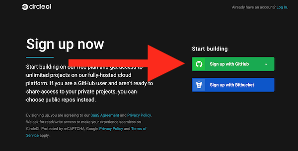

# Skill #9 - *Continuous Integration* with CircleCI

## I. Overview
- CircleCI is a cloud service that will *automatically* test your code whenever a change is committed to GitHub
  - This means that CircleCI will run our `npm test` script every time we push to GitHub, and email us if it fails
- What is *Continuous Integration* ?
  - "Integrating" (merging code branches) "hurts" - and because it hurts - we should do it more often (rather than less often) and ultimately it will end up hurting *less* over the long run
  - [YouTube - IBM Cloud - What is Continuous Integration? (6:20)](https://www.youtube.com/watch?v=1er2cjUq1UI)
  - [YouTube - IBM Cloud - What is Continuous Delivery? (5:50)](https://www.youtube.com/watch?v=2TTU5BB-k9U)
  - [YouTube - IBM Cloud - Continuous Deployment vs Continuous Delivery (5:34)](https://www.youtube.com/watch?v=LNLKZ4Rvk8w)

## II. Setting up CIrcleCI on a project

### II-A. Clone your start code
- We are going to be setting up a CircleCI project that will run tests for us every time we commit a project to GitHub
- Our starter code from today will be the repository we created the `npm test` script for last time - which is **first-web-service** (or **first-web-service-heroku**, or whatever you called it)
- Go ahead and `git clone <url>` this repository to a folder on your hard drive
- `cd` into the **first-web-service-heroku** folder and make it the *cwd*
- Type `npm run nodemon` and verify that everything works

### II-B. Set up a CircleCI account

- Sign up for a CircleCI account (using your GitHub account for login credentials) here:
  - https://circleci.com/signup/

### II-C. Create a project
  
- https://blog.stackpath.com/yaml/
- https://circleci.com/developer/orbs/orb/circleci/node

| <-- Previous Unit | Home | Next Unit -->
| --- | --- | --- 
|   [Skill #8 - Adding developer "tooling"](8-add-developer-tooling.md) |  [**IGME-430**](../) | Skill #10 - TBA
